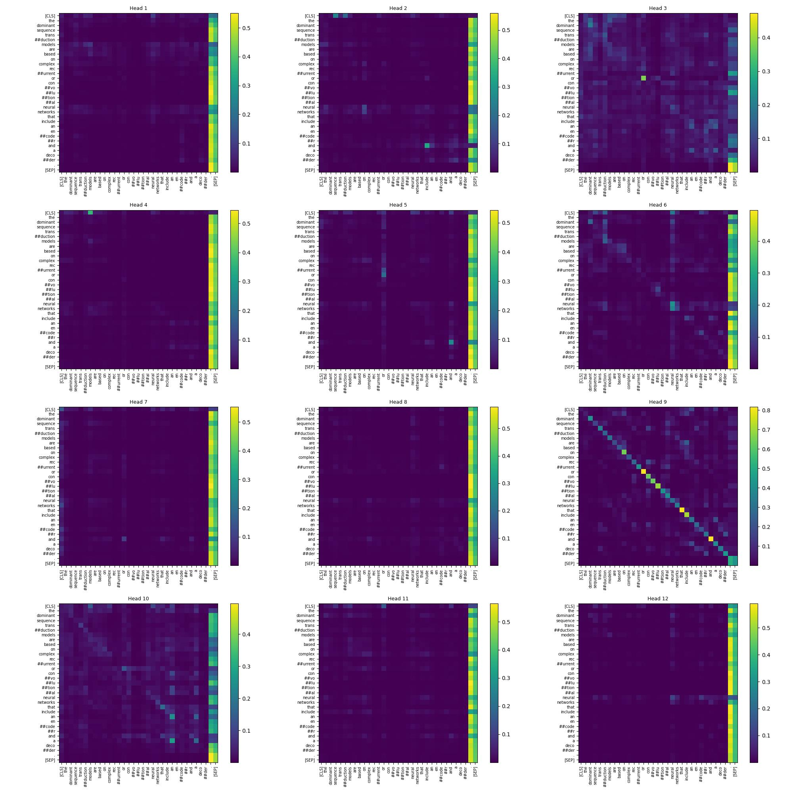

<h1 align="center">Transformers visualizer</h1>
<p align="center">Explain your 🤗 transformers without effort!</p>
<h1 align="center"></h1>

<p align="center">
    <a href="https://opensource.org/licenses/Apache-2.0">
        
    </a>
</p>

Transformers visualizer is a python package designed to work with 🤗 [transformers](https://huggingface.co/docs/transformers/index) package. Given a <code>model</code> and a <code>tokenizer</code>, this package supports multiple ways to explain your model by plotting its internal behavior.

This package is mostly based on the [Captum][Captum] tutorials [[1]][captum_part1] [[2]][Captum_part2].

## Installation

```python
pip install transformers-visualizer
```

## Quickstart

Let's define a model, a tokenizer and a text input for the following examples.

```python
from transformers import AutoModel, AutoTokenizer

model_name = "bert-base-uncased"
model = AutoModel.from_pretrained(model_name)
tokenizer = AutoTokenizer.from_pretrained(model_name)
text = "The dominant sequence transduction models are based on complex recurrent or convolutional neural networks that include an encoder and a decoder."
```

<details><summary>Attention matrices</summary>
<p align="center">Plot attention matrices of a specific layer</p>

```python
from transformers_visualizer import TokenToTokenAttentions

visualizer = TokenToTokenAttentions(model, tokenizer)
visualizer(text)
```

Instead of using `__call__` function, you can use the `compute` method. Both work in place, `compute` method allows chaining method.

`plot` method accept a layer index as parameter to specify which part of your model you want to plot. By default, the last layer is plotted.

```python
import matplotlib.pyplot as plt

visualizer.plot(layer_index = 6)
plt.savefig("token_to_token.jpg")
```

<p align="center">
    
</p>

<p align="center">Plot attention matrices normalized on head axis</p>

You can specify the `order` used in `torch.linalg.norm` in `__call__` and `compute` methods. By default, it's a L2 norm.

```python
from transformers_visualizer import TokenToTokenNormalizedAttentions

visualizer = TokenToTokenNormalizedAttentions(model, tokenizer)
visualizer.compute(text).plot()
```

<p align="center">
    
</p>

</details>

## Upcoming features

- [ ] Adding an option to specify head/layer indices to plot.
- [ ] Adding other plotting backends such as Plotly, Bokeh, Altair.
- [ ] Implement other visualizers such as [vector norm](https://arxiv.org/pdf/2004.10102.pdf).

## References

- [[1]][captum_part1] Captum's BERT example part 1
- [[2]][captum_part2] Captum's BERT example part 2


## Acknowledgements

- [Transformers Interpret](https://github.com/cdpierse/transformers-interpret) for the idea of this project.

[Captum]: https://captum.ai/
[captum_part1]: https://captum.ai/tutorials/Bert_SQUAD_Interpret
[Captum_part2]: https://captum.ai/tutorials/Bert_SQUAD_Interpret2